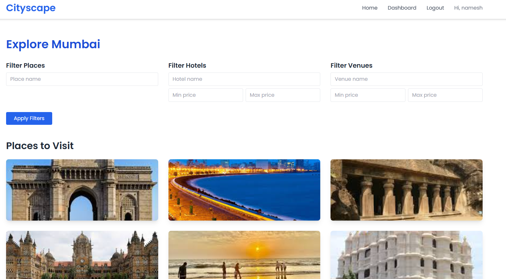

# Tourism Platform

## Overview

Tourism Platform is a web application designed to provide users with a comprehensive tourism experience. It allows users to explore cities, view places, hotels, and venues, and make bookings for their trips. The platform features a user-friendly dashboard, booking management, and detailed information about tourism places.

  
*Main dashboard showing cities and user bookings.*

---

## Architecture

The application follows a traditional web architecture with a Django backend serving dynamic HTML templates for the frontend. The backend handles business logic, database interactions, and user authentication, while the frontend uses Django templates enhanced with Tailwind CSS for styling.

### Backend

- **Framework:** Django (Python)
- **Database:** PostgreSQL
- **Key Components:**
  - **Models:** Represent entities such as City, TourismPlace, Venue, Hotel, and Booking.
  - **Views:** Handle HTTP requests, process data, and render templates.
  - **Forms:** Manage user input for bookings.
  - **Templates:** Render HTML pages with dynamic content.
- **Authentication:** Django's built-in authentication system is used for user registration, login, and session management.

---

### Frontend

- **Templating:** Django Templates
- **Styling:** Tailwind CSS via CDN
- **Icons:** Font Awesome
- **Fonts:** Google Fonts
- **Responsive Design:** Grid layouts and utility classes ensure responsiveness across devices.

  
*Responsive city listing page with Tailwind CSS styling.*

---

## Working

1. **User Registration and Login:**
   - Users can register and log in to access personalized features.
   - *Screenshot of the login page:*  
       
     *User registration and login form.*

2. **Dashboard:**
   - Displays a welcome message and a grid of cities with images.
   - Shows user's bookings with details such as booking type, dates, number of persons, time of visit, and extra amenities.
   
     
   *User dashboard with city images and booking details.*

3. **City Exploration:**
   - Users can explore places, hotels, and venues within a city.
   
     
   *Explore places, hotels, and venues within a selected city.*

4. **Booking:**
   - Users can book places, hotels, or venues by filling out booking forms.
   - Booking details are stored and displayed in the user's dashboard.

   
   
   *Booking form for reserving a hotel or venue.*

6. **Image Handling:**
   - City images are fetched from the local media folder `/media/city_images/{city_name}.jpg`.

---

## Schema Design

### Models

- **City**
  - `name`: Unique city name.

- **TourismPlace**
  - `city`: ForeignKey to City.
  - `name`: Name of the place.
  - `description`: Description text.
  - `image_url`: Optional URL for place image.

- **Venue**
  - `city`: ForeignKey to City.
  - `name`: Venue name.
  - `address`: Venue address.
  - `capacity`: Number of people it can accommodate.
  - `price_per_day`: Rental price.

- **Hotel**
  - `city`: ForeignKey to City.
  - `name`: Hotel name.
  - `address`: Hotel address.
  - `rating`: Hotel rating.
  - `price_per_night`: Price per night.

- **Booking**
  - `user`: ForeignKey to User.
  - `place`: ForeignKey to TourismPlace (nullable).
  - `venue`: ForeignKey to Venue (nullable).
  - `hotel`: ForeignKey to Hotel (nullable).
  - `start_date`: Booking start date.
  - `end_date`: Booking end date.
  - `number_of_persons`: Number of persons for the booking.
  - `time_of_visit`: Time of visit.
  - `extra_amenities`: Additional amenities requested.
  - `created_at`: Timestamp of booking creation.
   

---

## Deployment

- The project is containerized using Docker.
- PostgreSQL is used as the database backend bu using docker image.
- Django application is also containerized and run on isolated network to connect postgres to application.
- Environment variables are used to configure database connection.
- Static and media files are served appropriately stored in server.
- The application runs on port 8000 by default.
- For testing can copy paste "http://34.173.159.205:8000/" to see website hosted on Google cloud platform
  

---

## Additional Notes

- The project uses Django's built-in authentication system.
- Tailwind CSS is included via CDN for styling.
- Images for cities are stored locally in the media folder.
- Booking forms support detailed inputs including number of persons and extra amenities.

---

## How to Run Locally

1. Create or activate virtual environment ()
2. Install dependencies (Django, psycopg2-binary, etc.).
3. Configure PostgreSQL database and update `settings.py`.
4. Run migrations: `python manage.py migrate`.
5. Collect static files: `python manage.py collectstatic`.
6. Run the development server: `python manage.py runserver`.
7. Access the app at `http://localhost:8000`.

---

## Contact

For any issues or contributions, please open an issue or pull request on the repository.
